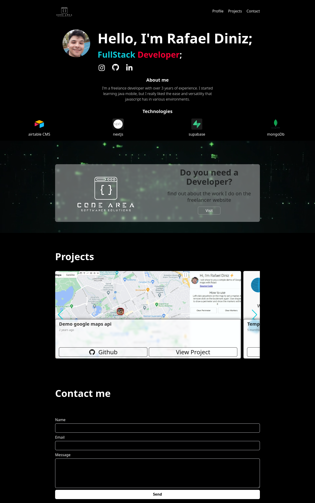

# Steps before to run app:
See .env.exemple
1. install node_modules from package manager
2. you will need a `API TOKEN AIRTABLE`

# Technologies
- Nextjs@13
- Typescript
- TailwindCSS
- ChackaUI
- Swiper.js
- Airtable

# Preview
